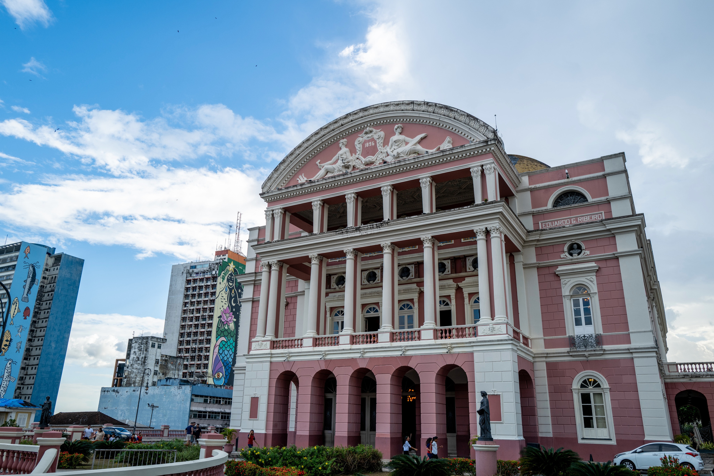
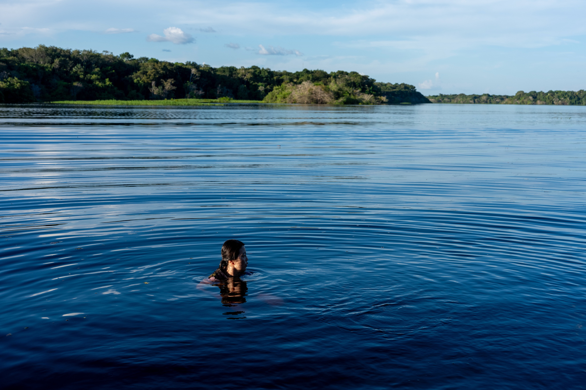
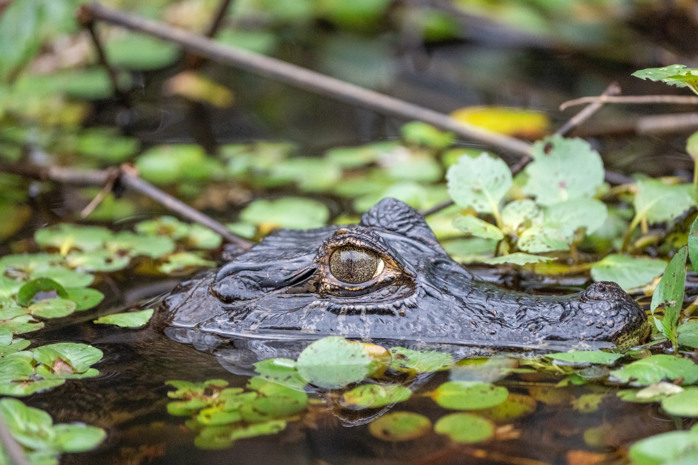
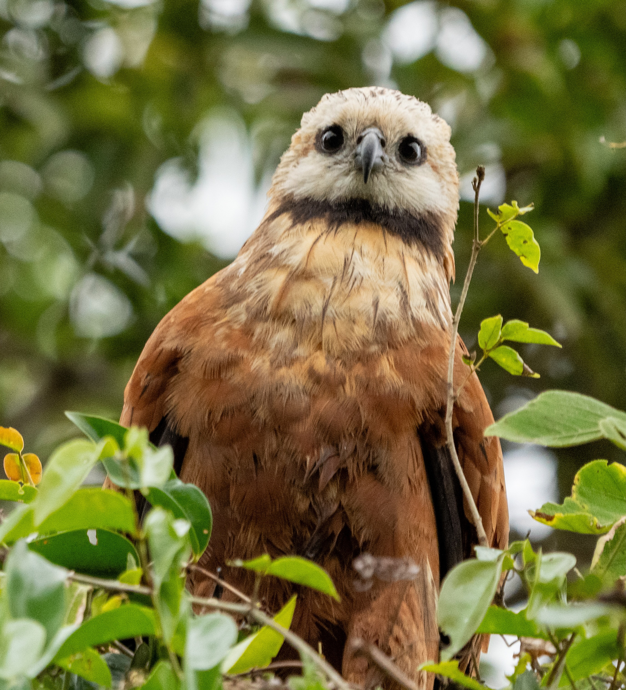
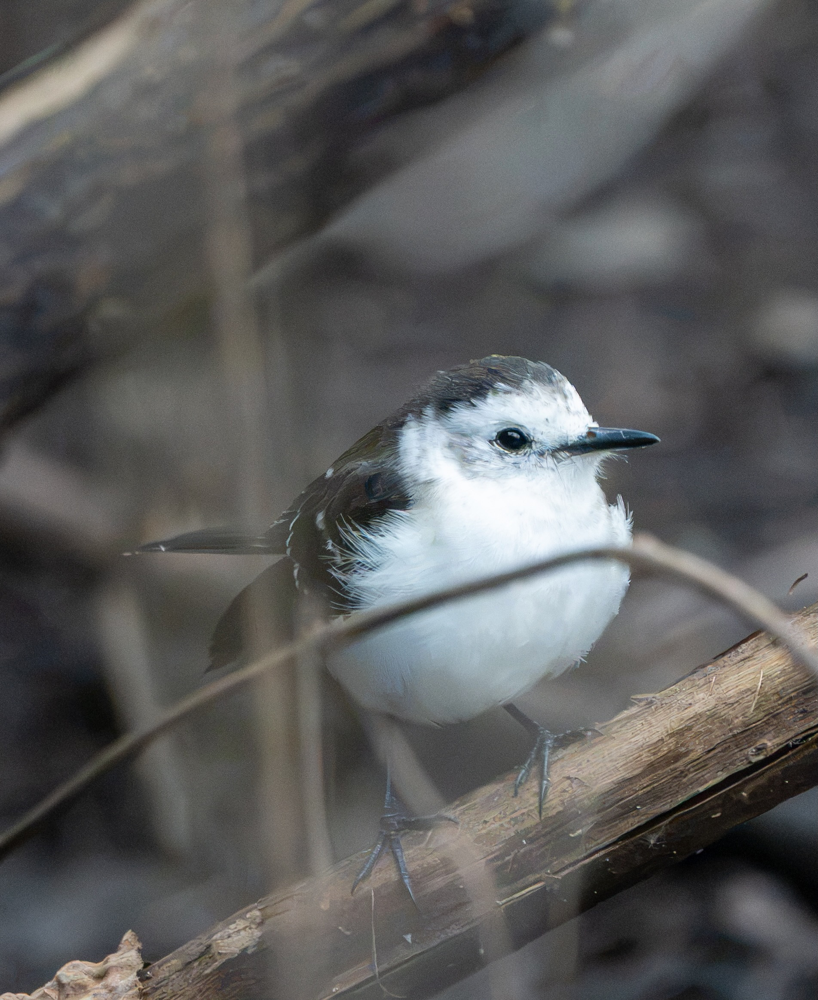
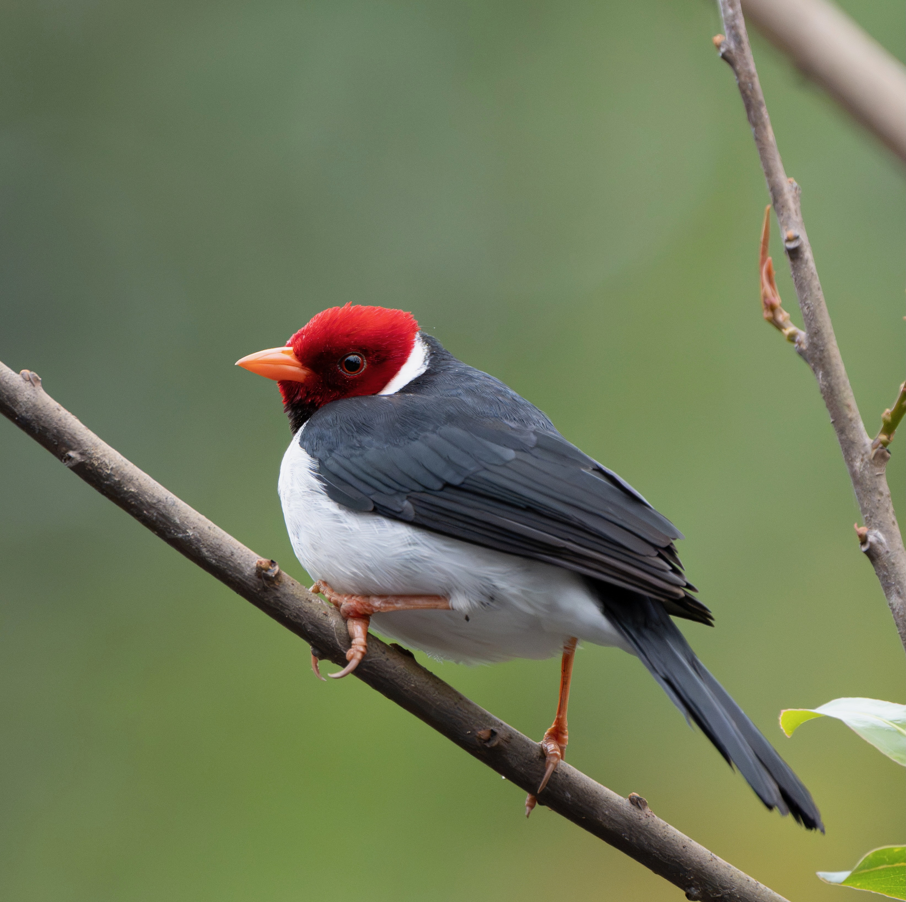
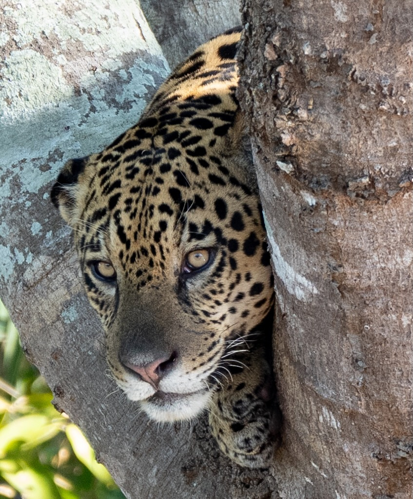
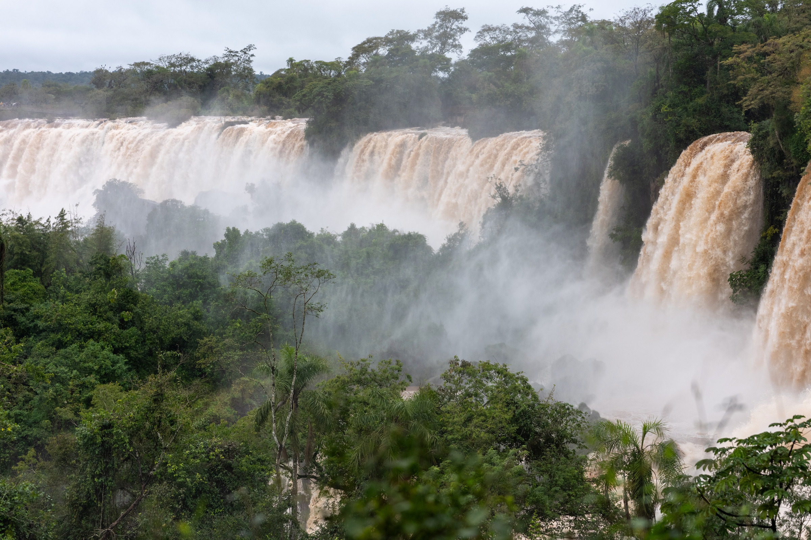
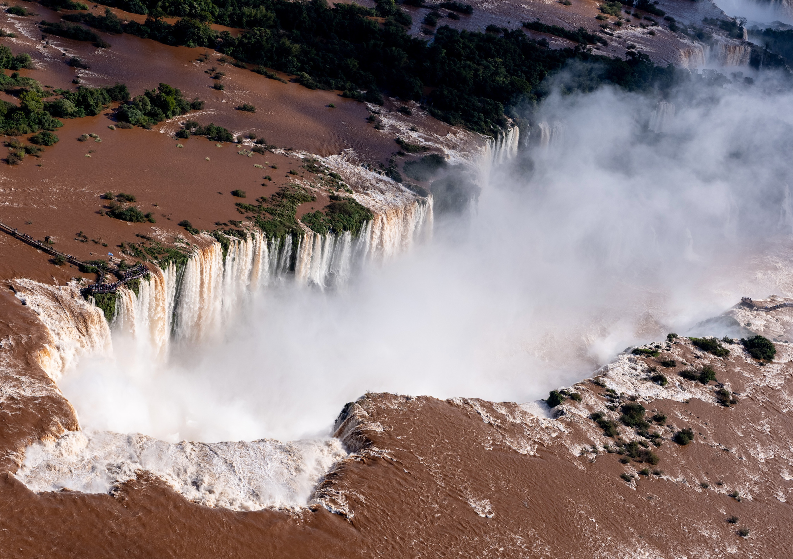

# Brazil, river to river

Manaus · Amazon · Pantanal · Iguazu

2026-06-17 – 2026-07-03

> Photo-based draft, not a verbatim account from the traveler. Dates cover these selected chapters, not a claim about the full trip’s departure or return. The album continues into July. Regional itinerary labels are inferred from the reviewed album sequence; exact lodges, routes, species and camera locations are not asserted.

## Manaus, before the river

2026-06-18 · Manaus, Brazil

Our Brazil story begins in Manaus. Before the river and the wildlife, there is the city: restaurant tables, a leafy courtyard, and the pink facade of Teatro Amazonas beneath an open blue sky.

June 18 · Teatro Amazonas, Manaus.

The photographs move from streets and the square to the theater’s ornate interior. Columns, balconies, painted ceilings: there is so much to look at before the landscape becomes our main subject. This is the first chapter I want to keep, a reminder that the journey began with people and a city, not only with animals.

## Room to slow down

2026-06-20 · Amazon region, Brazil

The river fills almost the entire frame. A small head breaks the surface; behind it, a dark strip of forest meets the blue sky. After Manaus, the photographs begin to leave room for water, trees, and distance.

> One small figure. A whole river around us.

I want to remember this change of scale. The city gave us buildings to look up at; here, the horizon stretches sideways. The swimming photographs from June 20 make a simple moment feel like the center of the journey.

June 20 · A quiet frame from the Amazon river days.

Other frames from these days bring the forest closer: boat rides, birds in the branches, and animals half hidden in leaves. Together they tell the story better than a list of stops. There is the wide view, and then there are all the little things inside it.

## Eyes at the waterline

2026-06-24 · Pantanal, Brazil

Among the floating green leaves, two eyes rise just above the water. The caiman is almost part of the surface. This is the Pantanal photograph that makes me look twice.

June 24 · A caiman, nearly hidden among the floating plants.

The frame rewards patience: first the plants, then the eyes, then the shape of the head. It belongs beside the broad river photograph from a few days earlier. One image asks us to step back; this one asks us to notice what is right in front of us.

## An afternoon in feathers

2026-06-24 · Pantanal, Brazil

On June 24, the camera moves from a raptor’s steady gaze to a bird tucked into the reeds, then to a red head and pale bill. These are three very different portraits from the same afternoon.

A steady gaze, framed by brown and cream feathers.

A small bird perched among the reeds.

A flash of red, with every feather in focus.

Eyes just above a floating carpet of green.

Each portrait holds a little of its surroundings: reeds, blurred green backgrounds, and water plants. Seen together, they turn an afternoon into more than a collection of sightings. The animals become the details through which I remember the landscape.

## A face in the branches

2026-06-27 · Pantanal, Brazil

A jaguar looks around a pale tree trunk, its face framed by bark and leaves. On June 27, the river photographs bring us this close view of the Pantanal’s most striking animal.

A jaguar looks around the trunk, framed by the riverbank trees.

The surrounding frames show the wider scene: boats on the water, capybaras along the bank, and the tree rising above the river. This portrait belongs in that sequence. It brings the landscape into focus through one pair of eyes.

## Iguazu, water in motion

2026-07-02 · Iguazu Falls

By July 2, the water has changed character. At Iguazu, broad brown curtains fall past green islands and disappear into white mist. The forest is still here, but the river no longer sits quietly in the frame.

**Map:** Iguazu Falls (-25.6953, -54.4367)

July 2 · Iguazu Falls, where the river becomes a wall of water and mist.

July 2 · Water and mist at Iguazu Falls.

The boardwalk photographs put people beside that enormous moving landscape. Nearby, coatis fill another set of frames. The final chapter holds both scales again: the falls that take over the view, and the small animals that bring our attention back to the path.

## The river, seen from above

2026-07-03 · Iguazu Falls

The next day, the aerial photographs pull us back from the falls. From above, the brown river spreads around green islands before tipping into a long white curve of water and mist.

The river and the falls in one wide view.

After the close view from the boardwalk, this is a different way to understand the same place. The forest, the river, and the drop finally fit into a single frame. It is a fitting last landscape for a journey that kept changing the scale of what we could see.

## What the water connects

2026-07-03 · Brazil journey

Looking through the album, water becomes the thread. There is the open river around a swimmer, the still surface around a caiman, the riverbank beneath a jaguar, and finally Iguazu’s falls. The photographs do not all show the same Brazil, and that is what gives the journey its shape.

> From a quiet horizon to a frame full of falling water.

I want to keep the city at the beginning, too: the theater, the streets, the people at the table. Those photographs give the wildlife and landscapes a human beginning. Together, the chapters hold more than our best pictures. They hold the way one place led us toward the next.
